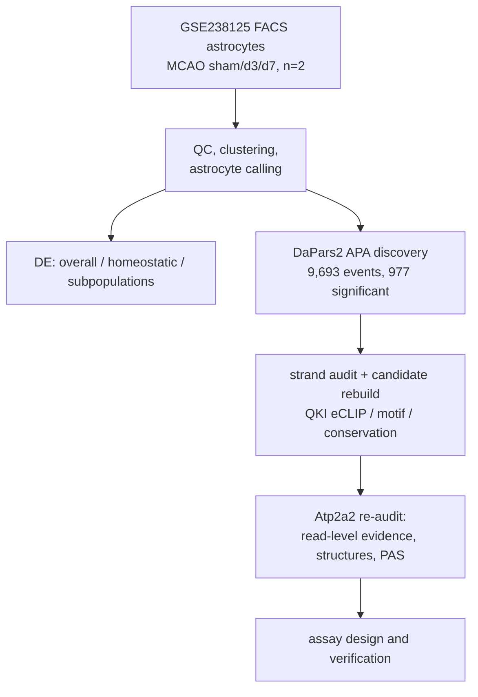
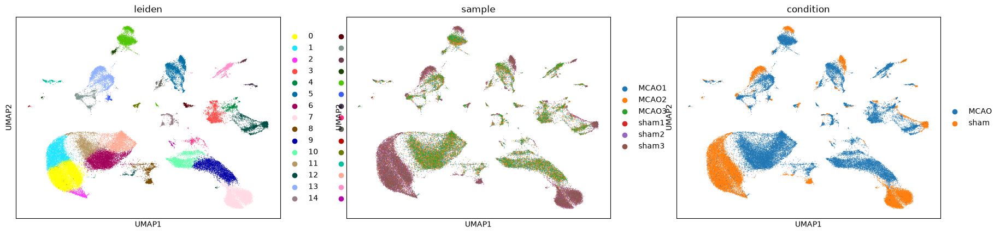
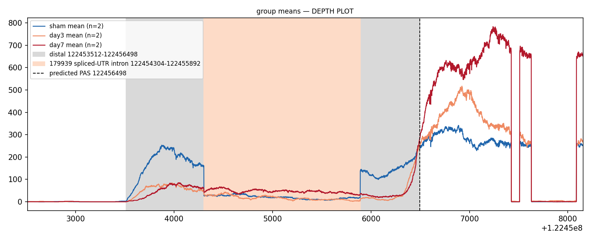

# Stroke-APA-

Computational study of alternative polyadenylation (APA) in mouse cortical
astrocytes after ischemic stroke, and the 3′UTR isoform evidence for the lead
gene **Atp2a2** (SERCA2). Built on the public FACS-sorted astrocyte stroke
time course GSE238125 (MCAO vs sham). Reference: mm10/GRCm38, GENCODE vM25.

All results in this repository are computational. No wet-lab experiments have
been performed; the qPCR/RACE assay designs for the lead event are provided
in silico only.

## What is here

- `scripts/` — pipeline code, grouped by phase
- `results/` — frozen result tables and figures from each phase
- `docs/` — reports and the reproduction manual (`实验流程.md`, `REGENERATE.md`)
- `figures/` — main figures, copied from `results/`
- `tests/` — regression tests for the read-level parsers
- `data/`, `configs/`, `envs/`, `tools/` — input anchors, frozen settings,
  conda environments, patched DaPars2 source

Raw data is not redistributed. Sources and checksums: `data/DATA_MANIFEST.md`;
re-download and rebuild commands: `docs/REGENERATE.md`.

## Study design



## Findings

- Widespread 3′UTR shortening after stroke: 9,693 APA events quantified,
  977 significant (FDR < 0.05); **Pabpn1** and **Qk** are the top regulator
  candidates. The candidate layer was rebuilt after a negative-strand error
  was found in the initial lost-segment definition.
- Lead event **Atp2a2** (chr5:122,453,512–122,456,498, negative strand):
  distal/shared coverage ratio drops from ~0.30 (sham) to ~0.085 (day 3/7);
  reads spanning the long-isoform junction drop ~96%; the pre-mRNA control
  region stays stable, so this is an isoform-composition change, not
  transcriptional collapse.
- The long isoform (ENSMUST00000179939) has a **split 3′UTR**: its UTR is
  interrupted by a 1,588 bp intron. This gives isoform-specific detection
  anchors (unique 447 bp segment and unique junction). The short isoform
  (ENSMUST00000177974) has a unique splice junction; the medium isoform has
  none and is identifiable only by its 3′ end.
- The DaPars2-predicted proximal PAS (chr5:122,456,498) has no poly(A)
  signal and only noise-level 3′-end support — a window-boundary artifact.
  The supported proximal end is the annotated end chr5:122,456,339
  (PolyASite cluster, 7 datasets); the terminal end is strongly supported
  (signal 332.5, 9 datasets).
- Public PAP-vs-soma datasets (GSE74456, GSE143531) show no isoform
  distribution differences for Atp2a2 — negative result, retained.

Caveats: discovery cohort is n=2 per group with a shared sham; all findings
are candidate observations from one public dataset. Per-file evidence labels
are in the result tables (`evidence_class` column, rules in
`configs/frozen_evidence_class.md`).





## Repository layout

```
├── README.md
├── LICENSE
├── requirements.txt                   # tool/library versions (envs/ is authoritative)
├── run_all.py                         # stage plan
├── configs/                           # coordinate conventions, frozen parameters
├── data/                              # DATA_MANIFEST.md + frozen input anchors
├── docs/                              # reports, 实验流程.md, REGENERATE.md
├── results/
│   ├── v5_1/                          # main analysis: QC, clustering, DE, APA, regulators
│   ├── reanalysis/                    # strand audit, candidate rebuild, BAM review
│   ├── 06_gate1_reaudit/              # re-audit of the lead event (2026-09-24)
│   └── 07_followup_20260925/          # structures, read evidence, PAS evidence, assays
├── figures/                           # main figures
├── scripts/                           # pipeline code by phase
├── tools/DaPars2_patched/             # patched DaPars2 (empty-coverage → NA)
├── envs/                              # conda environments
└── tests/                             # parser regression tests
```

## Reproducing

```bash
git clone https://github.com/Tiannn0512/Stroke-APA-.git
cd Stroke-APA-
conda env create -f envs/bioinfo.yml   # pysam, primer3, pyfaidx, matplotlib
conda env create -f envs/dapars2.yml
conda env create -f envs/rlimma.yml    # R 4.3.3 + limma/edgeR
python run_all.py                      # stage plan
python -m pytest tests/ -q             # parser regression tests
```

External tools: STAR 2.7.11b, samtools 1.19.2, bedtools 2.31.1, salmon 1.10.3,
FIMO 5.5.9, IGV 2.18.4. Full inventory: `docs/ENVIRONMENT.md`.

Start reading here: `docs/PROJECT_FULL_REPORT.md` (main analysis),
`docs/REANALYSIS_FINAL_REPORT.md` (strand audit and candidate rebuild),
`results/07_followup_20260925/executive_summary.md` (lead event, one page).

## Key result files

| Item | File |
|---|---|
| APA events (genome-wide) | `results/v5_1/p2_gate_g2_top_events.tsv` |
| Candidate ranking (strand-corrected) | `results/reanalysis/02_candidate_rebuild/candidate_ranking_v2.tsv` |
| Regulator catalog | `results/v5_1/p1_regulator_catalog.tsv` |
| Atp2a2 read evidence | `results/07_followup_20260925/Atp2a2_local_read_evidence.tsv` |
| Transcript structures / PAS evidence | `results/07_followup_20260925/Atp2a2_transcript_structure.tsv`, `PAS_evidence_table.tsv` |
| Assay designs (in silico) | `results/07_followup_20260925/assay_design_verified.tsv`, `primer_pair_products.tsv` |
| Public-cohort re-checks | `results/07_followup_20260925/PAP_evidence_table.tsv`, `public_dataset_suitability.tsv` |

## Data availability

All inputs are public; nothing is redistributed except manifests and derived
anchors. GSE238125 (discovery), GSE74456/GSE143531/GSE225110/GSE330741
(re-checks), GENCODE vM25, PolyASite 2.0, UCSC mm10, ENCODE QKI eCLIP,
ATtRACT. Details: `data/DATA_MANIFEST.md`.

Frozen snapshots: [Releases](https://github.com/Tiannn0512/Stroke-APA-/releases).

## Citation

```bibtex
@software{stroke_apa_2026,
  title  = {Stroke-APA: computational analysis of stroke-induced 3'UTR
            isoform shifts in astrocytic Atp2a2},
  author = {Tiannn0512},
  year   = {2026},
  url    = {https://github.com/Tiannn0512/Stroke-APA-}
}
```

## License

[MIT](LICENSE). Public datasets and annotations keep their own terms.
